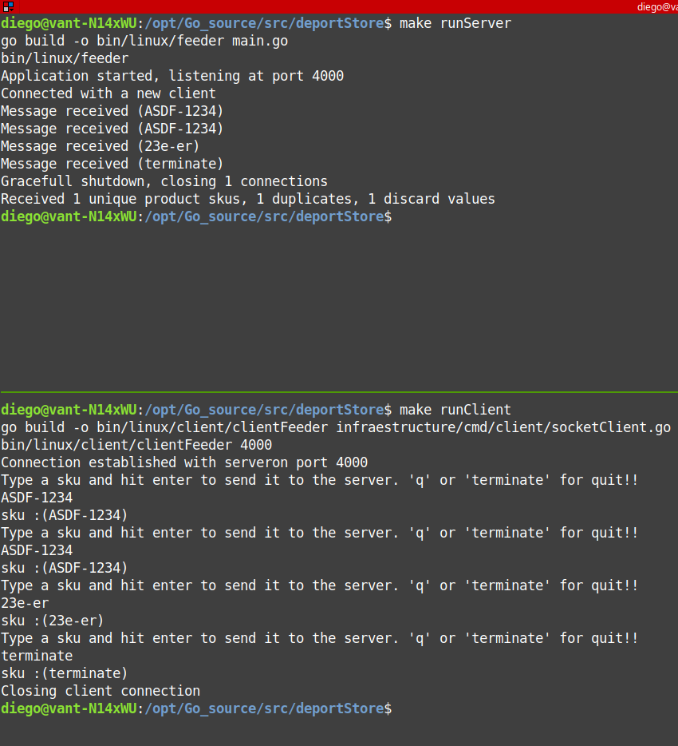

# Feeder

## Estructura del proyecto

```bash
.
├── application
│   └── feeder
│       ├── feederRepo.go
│       ├── feederService.go
│       ├── feederService_test.go
│       ├── skuCodeValidator.go
│       └── skuCodeValidator_test.go
├── bin
│   └── linux
│       ├── client
│       │   └── clientFeeder
│       └── feeder
├── domain
│   └── product.go
├── go.mod
├── infraestructure
│   ├── cmd
│   │   ├── client
│   │   │   └── socketClient.go
│   │   ├── socketEntry.go
│   │   └── socketEntry_test.go
│   └── repo
│       └── inmemory
│           ├── inmemoryFeederRepo.go
│           └── inmemoryFeederRepo_test.go
├── main.go
├── Makefile
└── README.MD
```
* **application**, contiene la lógica de negocio de la aplicación,  por ejemplo las validaciones de formato del código SKU.
* **domain**, definiciones de objetos propias de nuestra lógica de negocio.
* **infraestructure**, implementaciones concretas de las interfaces definidas por la capa de aplicación, así como también el código que usa el aplicativo para comunicarse con el exterior, por ejemplo el código que expone el socket a los clientes.
* **bin**, ficheros ejecutables de nuestra aplicación una vez construida, para generarlos lanzar el comando "make" sin parámetros.
    - **bin/linux/feeder**, el ejecutable del servidor.
    - **bin/linux/client/clientFeeder** el ejecutable del cliente, para pruebas.

## Build
```sh
$ git clone https://github.com/dipaso50/deporStore.git 
$ cd deporStore/
$ make
```

## Run test
```sh
$ make test
$ make testv //muestra más detalle de la ejecución de los test
```

## Ejecutar el servidor
```sh
$ make runServer
```

## Ejecutar el cliente, para pruebas
```sh
$ make runClient
```

## ScreenShots 

